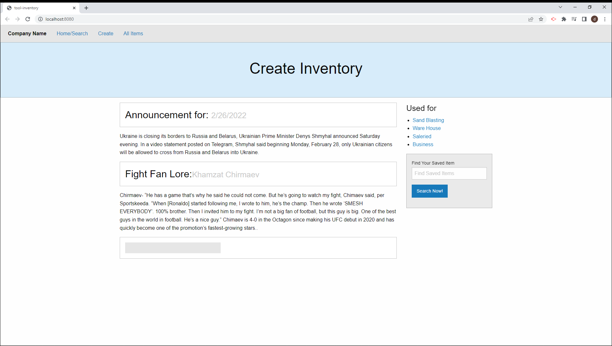
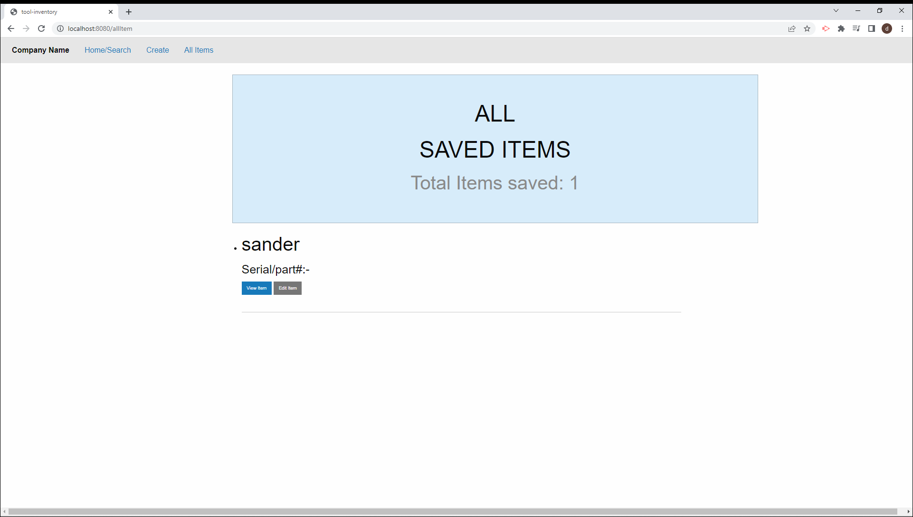
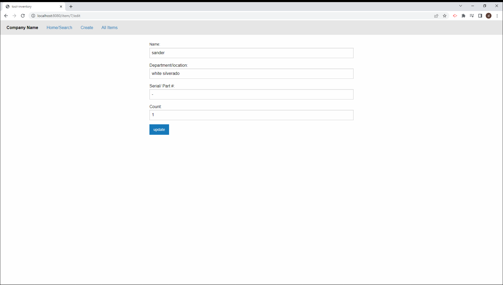
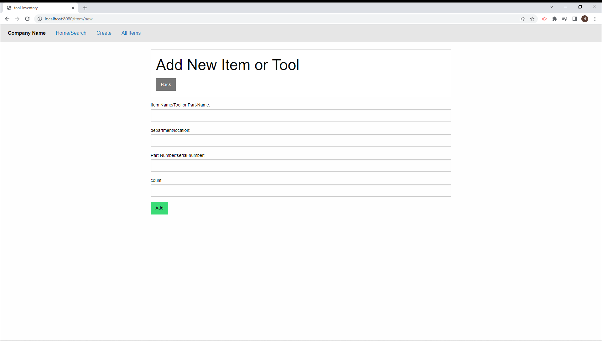

# Documentacion

## controles 


```
{ 
  id:,
  personName: "",
  personPosition: "",
  personDepaertement:"",
  personPassword:"",
  possesion:
}
```


 by department/crew name depending on client needs. Allows user to create, edit, view a single item or department items, view all items, and delete items/ inventory; app saves items and work crew/ department name, all inventory item/ tool serial number, location or description of item,the quantity and save and updated date to the database all manageable thru the app.

### pitch 
- Having many tools and a deep inventory is essential to running a business. Keeping track of who has it, where it is, how much of it is in stock. And knowing all the details of the items can be dificult to keep track of and manage. That is why Code & Code LLC created tool-inventory; to help businesses save serial numbers, part number for any tool or materials. Also, stores the quantity, the location/ description and who it was assignd to or counted/ created the Item. Futhermore, on an associated table the app allows user to save the supervisor/ manager name as well as the lead of the Crew or more depending of client especification. tool-inventory data is stored and saved to a relational database  accessable enywhere in the wrold by just visiting the app thru any mobile device or desktop connected to the internet. !lets help businesses micro mangage assets; allocate responsibilitys, document the pertain employees, locations, counts and other details; therefor, facilitate the tracking of forgotten or lost tools and inventory.


### technologys
- Ajax, Handlebars.js, Express, Sequelize, Node, MySQL2, Foundation CSS framework, Heroku, JawsDB, JavaScript


# Documentation
> ## controllers\departmentCrewController.js 

- Route bellow calls all `department ` department table resources on the database and and renders them `views/index.handlebars file/ Home search Page `  and are appended to ` #each <ul>` tags.
```
router.get("/", (req, res) => {
  db.Department.findAll({include: db.Item})
    .then((departments) => {
      res.render("index", { allDepartments: departments });
    })
    .catch((err) => {
      console.log(err);
      res.status(500).json({
        error: true,
        data: null,
        message: "unable to retrive allDepartments",
      });
    });
});
```
- Bellow route calls `department`  database table and renders them to the allDepartments.handlebars file/ "All Departments page" in the navbar
```
router.get("/allDepartments", (req, res) => {
  // db.Department.findAll({include: "items"})
  db.Department.findAll()
    .then((departments) => {
      // res.json(departments);
      res.render("allDepartments", { allDepartments: departments });
    })
    .catch((err) => {
      console.log(err);
      res.status(500).json({
        error: true,
        data: null,
        message: "unable to retrive allDepartmentCrew",
      });
    });
});

```
- code route renders the `views/allDepartment page`/ "All Departments page" on the navbar
```
router.get("/addDepartmentPage/new", (req, res) => {
  res.render("addDepartmentPage");
});

```


---
> New images of the updated application version will soon be available

[this is the link to the page](https://tool-inventory.herokuapp.com/)





---
> ### Starting from scratch
- create server.js file in the the root repository, run npm ` init -y ` in the root of project; 
- in the root run ` npm i express ` inside the server.js file
- created a server with middleware and test routes
- created controller folder inside controller folder created .js files with api routes

